# Desafio IA

Este repositório é referente a um desafio para detecção (segmentação) de vegetação.
Ele é etruturado em 4 etapas:

- preparação dos dados;
- geração de dataset;
- treinamento do modelo;
- validação (inferência utilizando modelo treinado).

###
## Quebra de imagem em blocos

### Informações sobre dados utilizados

Após análise da imagem `Orthomosaico_roi.tif` no QGIS, foi possível observar as seguintes informações sobre a imagem:

- Largura: 7572
- Altura: 3849
- Tipo de dado: Byte - Inteiro de 8 bits sem sinal
- Metadados do driver GDAL: GeoTIFF
- Nº de Bandas: 4
- Escala: 1
- Banda 1:
    - STATISTICS_MAXIMUM=255
    - STATISTICS_MEAN=147.59185051023
    - STATISTICS_MINIMUM=0
    - STATISTICS_STDDEV=37.511229713501
    - STATISTICS_VALID_PERCENT=100
- Banda 2: 
    - STATISTICS_MAXIMUM=251
    - STATISTICS_MEAN=146.4752618251
    - STATISTICS_MINIMUM=0
    - STATISTICS_STDDEV=36.13321651472
    - STATISTICS_VALID_PERCENT=100
- Banda 3: 
    - STATISTICS_APPROXIMATE=YES
    - STATISTICS_MAXIMUM=254
    - STATISTICS_MEAN=142.3536357843
    - STATISTICS_MINIMUM=0
    - STATISTICS_STDDEV=35.446070604004
    - STATISTICS_VALID_PERCENT=100
- Banda 4: 
    - STATISTICS_MAXIMUM=255
    - STATISTICS_MEAN=250.93260257088
    - STATISTICS_MINIMUM=0
    - STATISTICS_STDDEV=31.94749790798
    - STATISTICS_VALID_PERCENT=100

Os dados extraídos indicam que não há necessidade de normalização e prcessamentos adicionais nas imagens, dado que os valores dos pixels estão entre 0 e 255 e não há dados inválidos. Pode-se observar que há 4 bandas na imagem, porém serão utilizados somente as 3 primeiras, que representam os canais RGB.
### Utilização do script para subdivisão da imagem

Para subdividir a imagem em subimagens, basta executar o seguinte comando:

```bash
    python divide_orthomosaic.py --input </path/to/orthomosaic.tif> --output </path/to/output/dir/>
```

onde `--input` deve indicar o caminho para a imagem e `--output` o diretório onde as imagens serão salvas.

### Exemplo de imagens subdivididas


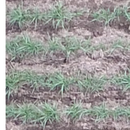   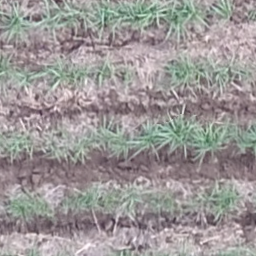  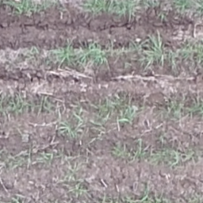 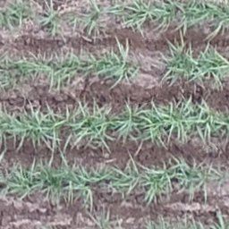

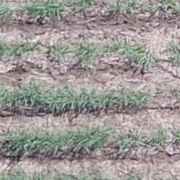   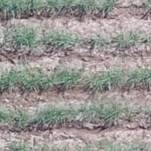  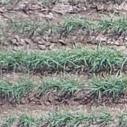 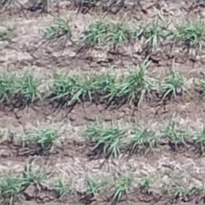

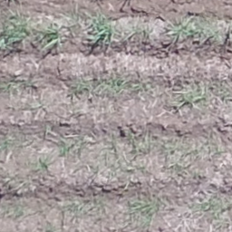   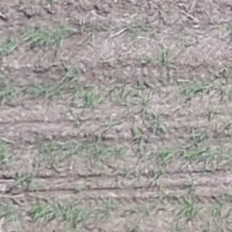  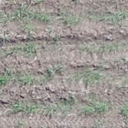 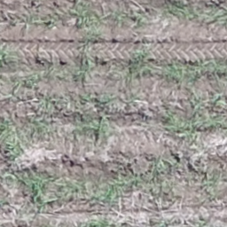


## Geração de Dataset

Para gerar o dataset com máscaras de segmentação são utilizadas as subimagens geradas na etapa anterior. O método adotado para gerar as máscaras foi o ExG (Excess Green Index), que analisa os canais Vermelho (R), Verde (G) e Azul (B) e torna evidente o canal verde. Isto se dá através da formula `2 * g − r − b`. Logo após esta operação, é utilizado um limiar (definido como 128) visando binarizar a máscara resultante. Para gerar o dataset, basta executar o seguinte comando:

```bash
   python binarize_images.py --input </path/to/images/dir> --output </path/to/segmented/dir/>
```
onde `--input` deve indicar o caminho para o diretório das subimagens e `--output` o diretório onde as máscaras serão salvas.

### Exemplo de imagens e respectivas máscaras

Imagem RGB            |  Máscara (ground truth)
:-------------------------:|:-------------------------:
  |  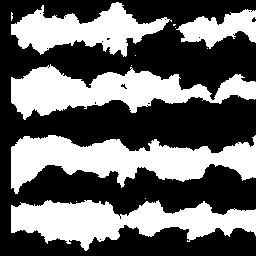

Imagem RGB            |  Máscara (ground truth)
:-------------------------:|:-------------------------:
  |  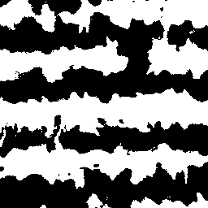

Imagem RGB            |  Máscara (ground truth)
:-------------------------:|:-------------------------:
  |  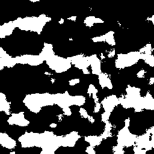


## Implementação e Treinamento de Rede Neural

Para treinar um modelo de segmentação semântica para vegetação, foi selecionado um modelo pré-treinado, especificamente o modelo DeepLabV3+ com backbone da ResNet50. Para isto, fram utilizadas as blibliotecas Tensorflow e Keras. Foi utilizado o otimizador Adam e as métricas Intersection over Union (IoU) e acurácia para avaliar o treinamento do modelo. 

### Parâmetros de treinamento

- Tamanho das imagens: 256x256
- Batch Size: 32
- Épocas: 200
- Imagens de treinamento: 408
- Imagens de validação: 72
- Otimizador: Adam
- Rede pré-treinada: DeepLabV3+ com ResNet50 como backbone
- Métricas de avaliação: BinaryIoU e Accuracy

Algumas destas configurações, tais como batch size, épocas, taxa de divisão (validação/treinamento), dentre outras, podem ser configuradas em `config/config.py`.

### Estrutura do código

- `net/resnet50.py`: implementa classe `SegmentationResnet50`, responsável por agrupar diferentes funções para carregar modelo pré-treinado, carregar dataset, salvar modelo, gerar inferências a partir de imagens, etc.
- `config/config.py`: agrupa parâmetros de treinamento e outras configurações;
- `train_model.py`: gerencia parâmetros de execução, instancia classe `SegmentationResNet50`, treina e salva o modelo.

### Treinamento

Para realizar o treinamento do modelo e salvá-lo, execute o seguinte comando:

```bash
   python train_model.py --rgb </path/to/images/dir> --groundtruth </path/to/segmented/dir/> --modelpath </path/to/model.h5>
```

onde `--rgb` indica o diretório com dataset RGB, `--groundtruth` as respectivas máscaras do dataset, e `--modelpath` diretório/nome do modelo a ser salvo ao final do treinamento. 

### Resultados de treinamento

Durante o treinamento do modelo, algumas métricas foram calculadas, tanto para dados de treino quanto de validação. As métricas utilizadas foram Acurácia e BinaryIoU. Esta última visa avaliar o quanto a inferência é similar ao ground truth.


Acurácia            |  BinaryIoU
:-------------------------:|:-------------------------:
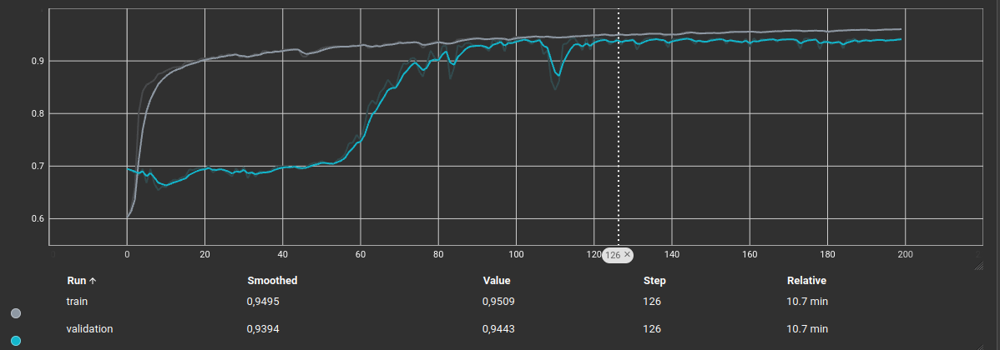  |  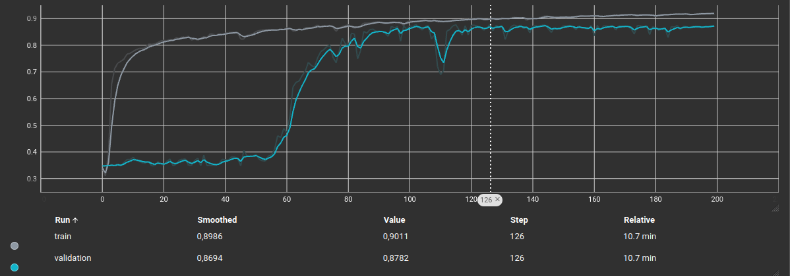


Note que, em dado momento, por volta da época 126, as métricas se estabilizam, com acurácia chegando a aproximadamente 94,43% e BinaryIoU em 87,82%, ambas nos dados de validação.

## Inferência do Modelo

Após o treinamento do modelo, é possível carregar e utilizar os pesos treinados para segmentação de imagens com vegetação. Para isto, é importante respeitar a mesma escala utilizada para treinamento. Imagens com resoluções baixas podem não ter resultados precisos.

Apesar das imagens utilizadas para treinamento da rede possuirem dimensões de 256x256 pixels, é possível inferir imagens de dimensões superiroes. Para isto, o algoritmo de inferência faz a leitura da imagem em janelas menores e realiza a predição a partir destas subimagens. Antes de executar a operação em questão, uma matriz de mesma dimensão da imagem de entrada é inicializa com valores zerados. Conforme o algoritmo realiza o janelamento e a predição, a matriz auxiliar é preenchida com as máscaras resultantes. Ao final, essa matriz é salva como uma imagem binária. 

Para binarizar a 

### Execução da inferência

Para executar a inferência e gerar uma máscara segmentada para vegetações, basta executar:

```bash
   python model_inference.py --rgb </path/to/image.png> --modelpath </path/to/model.h5> --output </path/to/segmented/image.png>
```

onde `--rgb` indica a imagem a ser predita, `--modelpath` o caminho do modelo previamente treinado, e `--output` diretório/nome que a máscara gerada deverá ter ao ser salva. 

### Resultado com imagem ortomoisaica de canavial

A partir de uma imagem obtida em [lapix.ufsc.br/wp-content/uploads/2019/05/sugarcane2.png](https://lapix.ufsc.br/wp-content/uploads/2019/05/sugarcane2.png), foi possível testar o modelo treinado. Assim como descrito anteriormente, a imagem é subdidivida em subimagens e a inferência é realizada por janelamento. O modelo gera valores entre 0 e 1 para cada pixel da imagem, sendo assim, é necessário binarizar o resultado para gerar uma máscara binária. O valor do limiar escolhido foi de 0.9, que pode ser configurado em `config/config.py`.

Abaixo, é possível visualizar a imagem de teste e respectiva máscara obtida ao ser analisada pela rede treinada. O resultado obtido é bastante robusto, ainda mais considerando as diferenças entre imagens utilizadas para treinamento e a imagem de teste.

Imagem de Teste            |  Segmentação obtida
:-------------------------:|:-------------------------:
  |  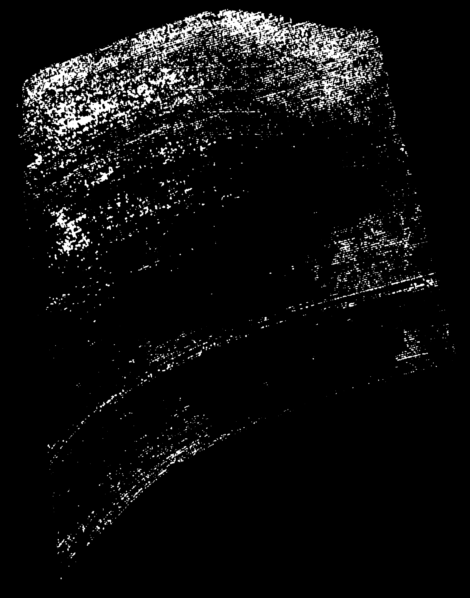


## Discussão sobre o Desafio
